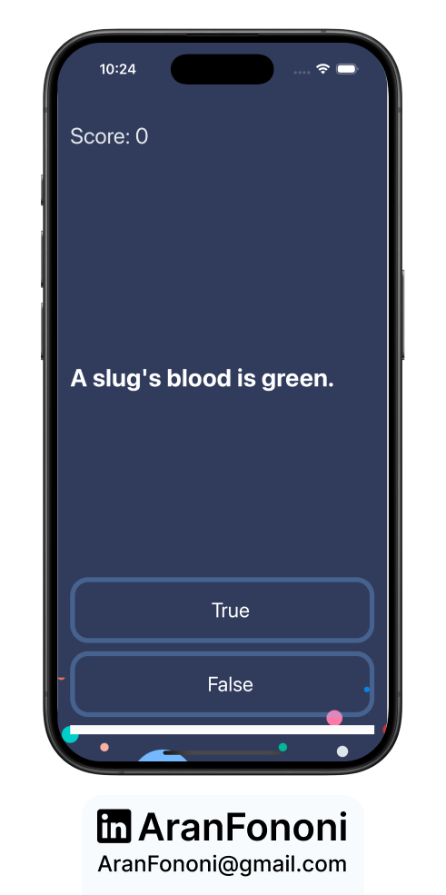
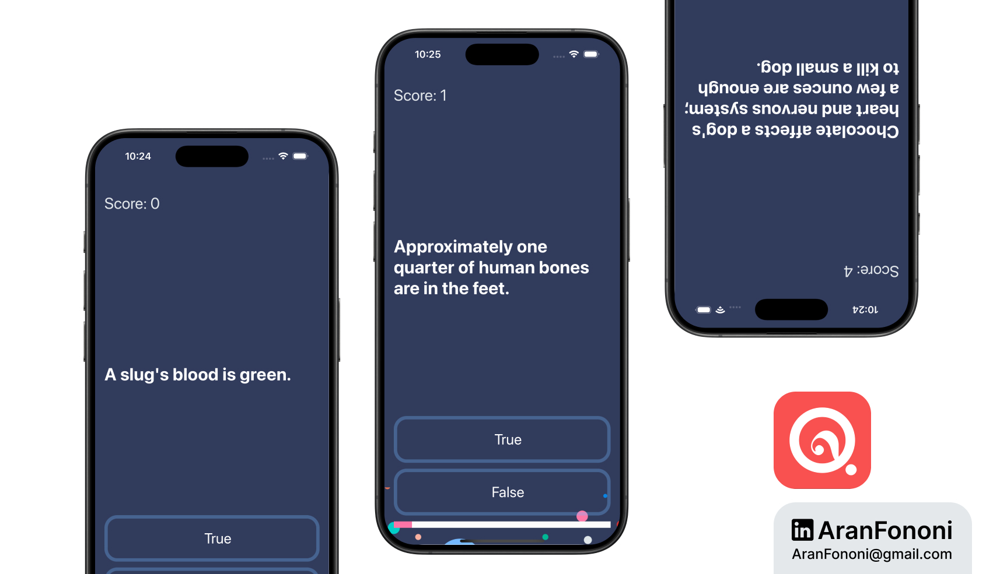

# Quizzler

### Project for Section 9: **Model-View-Controller Pattern**  
This project was completed as part of Section 9 in the **Complete iOS Development Bootcamp** by Angela Yu.

## Project Overview
The **Quizzler** app is a simple trivia game that asks users multiple-choice questions. Users can select true or false answers, and their score is tracked throughout the game.

## What I Learned
In this project, I focused on:
- **Model-View-Controller (MVC)**: Implemented a clean architecture by separating the quiz logic from the UI.
- **Dynamic Question Structure**: Created a separate model for questions to allow for future expansion, including multi-language support.
- **User Interaction**: Managed user responses and updated the UI accordingly.

## Key Skills
- Understanding the MVC pattern in iOS development
- Building dynamic data structures for better scalability
- Updating UI elements in response to user actions

## Additional Features
Beyond the course scope, I structured the questions to be easily extendable for future versions of the app, allowing for the inclusion of additional languages and more diverse question formats.

---

### Project Preview

---

### Footer

---

## Contact
For more information, feel free to reach out:  
- **Email**: [aranfononi@gmail.com](mailto:aranfononi@gmail.com)  
- **LinkedIn**: [Aran Fononi](https://www.linkedin.com/in/aran-fononi-18182b265)
